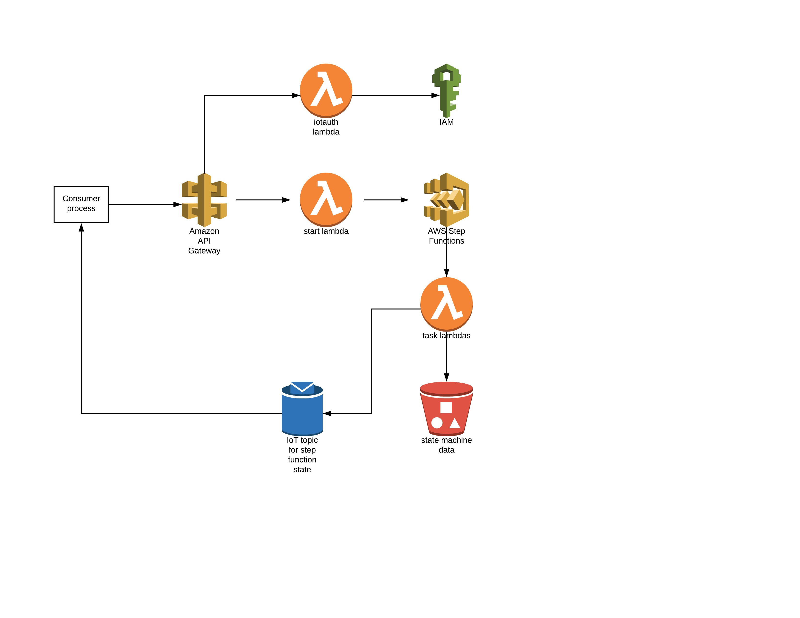

# sfs3 - step functions using s3 for data

## Overview

This project shows a simple example of a step function process
with steps that read data from s3 and write data to s3. Keeping the 
data in s3 allows us the leverage s3 encryption, bucket policies,
bucket lifecycle management, versioning, replication etc.

The following diagram shows all the pieces in the solution.



The solution is centered around invoking a step function state machine to orchestrate a sequence of tasks and the initiation of another state machine. The `s3-for-process-data` and `downstream` subdirectories contain serverless functions and their associated task lambdas.

The `s3-for-process-data` project includes the state machine definition, the associated lambdas, and a 'start process' API method to allow kicking off the step function state machine via an HTTP POST. This project uses s3 to store all state machine data to avoid data size limitations and to have more capabilities to secure the data. 

Note when using s3 in this way you need to account for the [S3 
consistency model](https://docs.aws.amazon.com/AmazonS3/latest/dev/Introduction.html#ConsistencyModel). In the sample code we include a read-predicate and retry count for each step to ensure the previous step's data has been read prior to proceeding.

The task lambas publish events related to state machine completion to an Iot topic formed using the base topic, any subtopic specified by the initiator of the execution, and the transaction id associated with the state machine execution.

For clients that want to know when the state machine initiated via an API call completes, there are two alternatives, polling for completion using the AWS APIs, or via subscribing for events.

For event pub/sub, IoT was selected based on its simplicity and its fit for purpose, namely notifying a single interested party about the completion of a state machine. For events related to the process implemented in the state machine in aggregate, since all state machine data is stored in an s3 object side car, a lambda function could be subscribed to s3 bucket events, which could then form events and write them to a Kinesis stream.

To enable connectivity to the IoT message broker without requiring AWS account credentials, the `iotauth` project exposes a service to return the iot endpoint, and temporary credentials that map to a role that allows connectivity to the iot endpoint, and the permission to subscribe to and receive events for a topic namespace.

### Cost Components

Refer to the AWS pricing documentation for the latest pricing and a more nuanced discussion, especially if you are looking to apply this pattern where a lot of external data transfer is involved.

* API gateway - currently $3.50 per million API calls received, plus data transfer out which is $0.09 per GB for the first 10 TB, getting cheaper after that.
* Lambda - currently free for the first 1 Million requests per month, then $0.20 per 1 million requests after that. Additionally there is a duration charge based on execution time and the amount of memory allocated, where the first 400,000 GB-seconds per month are free, and $0.00001667 per GB-seconds used thereafter.
* Step functions - varies by region but roughly $0.0250 per 1,000 state transitions.
* Iot - varies per region. In the US, connectivity pricing is $0.08 per 1 million minutes of connectivity. Messaging is based on messages transported to (e.g. publish) IoT Core, and from (e.g. receive) IoT core. In the US, the first 1 billion messages in a month cost $1.00.
* S3 - varies by region, but in the US it's roughly $0.023 per GB for the first 50 TB / month.

## Caveats

As a general note, this is a project that illustrates how to accomplish things using AWS, but does not represent a production hardened configuration.


### aws-iot-device-sdk proxy support

The current (as of world cup 2018 match day 2) SDK does not support connecting to the IoT endpoint via an http(s) proxy. There is an [active issue and pull request](https://github.com/aws/aws-iot-device-sdk-js/pull/214/files), and a fix that works with a simple proxy server can be applied to the SDK after you `npm install` it as follows:

First, replace the contents of device/lib/ws.js with this:

````console
const url = require('url');
const HttpsProxyAgent = require('https-proxy-agent');
const websocket = require('websocket-stream');
 

const proxy = process.env.http_proxy;
const proxy_usr = process.env.http_proxy_username;
const proxy_psw = process.env.http_proxy_password;
 

function buildBuilder(client, opts) {
   if(proxy) {
        console.log('using proxy server %j', proxy);
        var options = url.parse(proxy);
        if(proxy_usr && proxy_psw) {
            console.log('using proxy username & password');
            options.auth = proxy_usr + ':' + proxy_psw;
        }

        var agent = new HttpsProxyAgent(options);
        opts.websocketOptions.agent = agent;
    }
    else
        console.log('http_proxy is not defined. create web socket without proxy');

    return websocket(opts.url, ['mqttv3.1'], opts.websocketOptions);
}   

module.exports = buildBuilder;
````

Next, update the dependencies in the SDK's package.json to add the following:

````console
"https-proxy-agent": "2.2.1",
"url": "0.11.0"
`````

Then, in the `apiclient` directory:

````console
npm install https-proxy-agent
````

You can then set the proxy in your environment variables via `http_proxy` - use the full http://host:port form.


### IotAuth

The IotAuth endpoint is currently not secured - this will be remediated soon. Until it is secured anyone can call the endpoint and obtain credentials to consumer events published to the topic...

## Deployment

Using the sample assumes you've got the [serverless framework](https://serverless.com/) installed.

To install the sample, first install the downstream step function app. This is a step function process that is initiated by the main process.

To install it, cd into `downstream`, then:

````console
npm install
sls deploy --aws-profile <your profile>
````

Once downstream has been deployed, you can install the main sample. From the project root directory, cd into s3-for-process-data.

First, edit serverless.yml and change the bucketName name property under custom to something that will be unique to your account. Remember s3 bucket names must be globally unique. With the bucket name set, do this:

````console
npm install
sls deploy --aws-profile <your profile>
````

With both apps installed, you can instantiate the process either via the start endpoint, or via the supplied sample client.

To use the sample client, cd into the `client` directory. Set the following enviroment variables:

* AWS_PROFILE
* AWS_REGION
* HTTPS_PROXY
* BUCKET_NAME - set it to the bucket name as per above. Note that the current stage is appended to the name, which will be dev if you don't specify a stage.

Next, get the state function arn for ProcessA-<stage>. You can view it using the aws cli:

````console
aws stepfunctions list-state-machines
````

It will look like `arn:aws:states:us-east-1:<your account no>:stateMachine:ProcessA-<the stage>`

## Monitoring Dashboad

For a basic Cloud Watch dashboard that displays state metrics
for the process defined in the `s3-for-process-data` project, install the dashboard defined in `dashboard.yml`. You can use the `install-dashboard.sh` script to do so.

## Execution Creation and Subscription for Completion

The `apiclient` directory contains a sample that shows how to create an execution of a step functions state machine, and how to subscribe for notifiation on completion of the state machine.

To run, first install the iotauth service.

````console
cd iotauth
npm install
sls deploy --aws-profile <your profile>
````

With all the services installed, cd into the apiclient directory and set the following environment variables:

* TOPIC - set to the name of the topic the state machine step function is publishing to.
* START_ENDPOINT - the endpoint exposed by the s3-for-process-data service, available via `sls info`
* IOTAUTH_ENDPOINT - the endpoint exposed by the iotauth service, available via `sls info`

Once the envrionment variables are set, run the proces.

````console
npm install
node api.js
`````

You can then curl the endpoint to see the kick off and notification in action.

````console
curl -i -X POST localhost:3000/p1
````

In this example, including a subtopic property in the input that corresponds to the topic subscribed to in the process  set up narrows the set of notifications the process will need to handle. Without a subtopic then all events published to the topic will be received.

## Polling Client

The `client` directory contains an implementation of a AWS SDK client
that creates a step function execution, then polls the state of the 
execution until is is no longer in a running state.

To invoke the client:

````console
npm install
node client <stage-machine-arn>
````

The output should resemble:

````console
txnId: 0x58fe985b67000000
{ ETag: '"4b4ac399469f397e75f26ba0bfacb144"',
  ServerSideEncryption: 'AES256' }
arn:aws:states:us-east-1:427848627088:execution:ProcessA-dev:2e2b7150-9d3e-45dd-a363-cefb8bd7e85b
checkCondition
done
status: RUNNING
checkCondition
status: SUCCEEDED
````

Note the `txnId` is the name of the object in the bucket. You can inspect the contents of the object by writing it to standard out:

````console
$ aws s3 cp s3://ds97068processinput-dev/0x58fe985b67000000 -
{"foo":"foo val","bar":"bar val","step-a-output":{"status":"ok","details":"nothing to share","stepAOutput1":"a1","stepAOutput2":false,"stepAOutput3":123},"step-b-output":{"property1":"p1","property2":"p2"},"step-c-output":{"cProperty":"i like c"},"step-d-output":{"d":"d output"},"step-e-output":{"e":"e output"},"step-f-output":{"downstreamExecutionArn":"arn:aws:states:us-east-1:012301230123:execution:downstream-dev:23d21f43-2ee1-461d-9573-52e4b5524d49"}}
````

## Next

* Replace retry logic for failed consistency predicates with state machine retries.
* Add a heart beat event from Iot core to consumers.
* Add a polling back up to check for state machine completion should there be 
connectivity issues to Iot core.
